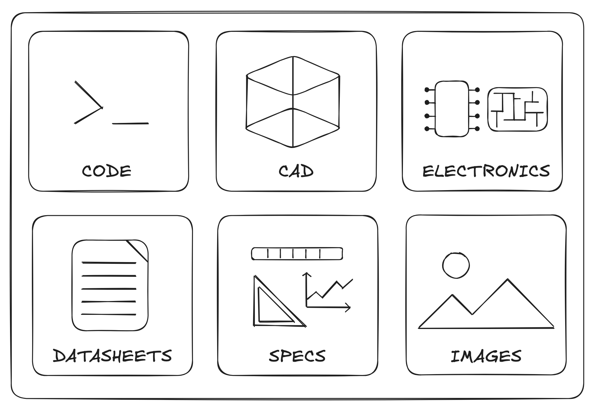

# Universal Hardware Description (UHD)

**An open, composable description language for multidisciplinary hardware engineering.**

[](LICENSE)
[](https://www.npmjs.com/package/@deltarobotics/uhd)
[](#project-status)

---

## What is UHD?

**Universal Hardware Description (UHD)** is the first open data model designed to robustly and scalably interchange and augment arbitrary hardware systems — across electrical, mechanical, pneumatic, thermal, and any future domain.

UHD is a **rich, common language for defining, packaging, assembling, and editing hardware designs**, and a foundation that tools, libraries, and applications can build on. Where each discipline today maintains its own incompatible representation — schematic capture for EE, CAD for ME, separate firmware-side data models — UHD provides one description that all of them share.

The reference model is the **single source of truth**; tools render views over it, and engineers across disciplines compose, override, and validate against the same underlying design.

---

## Why use UHD?

Three production imperatives shape every design decision in UHD:

1. **Provide a rich, common language** so that electrical, mechanical, firmware, and systems engineers describe the same hardware in the same terms — not in five disconnected formats glued together by spreadsheets.

2. **Enable multiple engineers to collaborate on the same system** without erasing or overwriting each other's intent. UHD's composition model is designed for **non-destructive overrides** (instances) layered on top of a shared base (definitions).

3. **Maximize design iteration by minimizing handoff latency.** When the description is shared, an EE change to a pinout is immediately visible to the firmware engineer; a mechanical change to a mounting interface flows straight through to the harness model. No re-export, no re-import, no lossy round-trip.

---

## Core concepts

UHD's data model rests on **four primitives**, deliberately kept small:

### Module

The universal container. A chip, a PCB, a robot arm, an entire spacecraft — all are **modules** at different scales. Modules contain interfaces, sub-modules, harnesses connecting those sub-modules, and references to external design artifacts. There is no separate notion of "board" or "system": everything is modules-of-modules, all the way down.

### Interface

The universal connection primitive. A GPIO pin, an I²C bus, a pneumatic port, a motor-control protocol, a mechanical mounting joint — all are **interfaces**. Interfaces are recursive: a complex interface composes from simpler ones via slots. Each interface carries two facets:

- **Protocols** face *outward* — used for matching across module boundaries ("can these two devices talk?").
- **Capabilities** face *inward* — used for binding leaf interfaces into composed slots within the same module ("which pins can form this I²C bus?").

### Harness

The topology between sibling sub-modules — single wire, bus, split, or selector (e.g. a removable USB cable). Harnesses describe **connectivity, not medium**: the model never assumes "wire" or "tube" — the same primitive serves electrical conductors, pneumatic lines, and mechanical linkages.

### Artifacts

The bridge between UHD's structural model and the rest of the design world. **Artifacts** attach to modules to provide richer detail — schematics, PCB layouts, CAD and 3D models, firmware source or repositories, datasheets, simulation results, documentation. UHD doesn't try to absorb these formats; it points to them, typing each artifact (`pcb`, `schematic`, `cad`, `firmware`, `datasheet`, `simulation`, `documentation`, ...) so downstream tooling can resolve, render, or act on them. Per-project overrides let an instance add or replace artifacts without touching the underlying definition.



Built on top of these primitives:

- **Protocols & roles** — typed contracts (`i2c.master ↔ i2c.slave`, `pwm.output ↔ pwm.input`) that drive validation.
- **Capabilities & slots** — hardware-level tags (`digital_io`, `pwm_out`, `i2c_sda`) that drive composition within a module.
- **Parameters & traits** — typed values with units, ranges, tolerances, and structured behaviors attached to modules and interfaces.

For the full design, read [docs/architecture.md](docs/architecture.md).

---

## What UHD can do

- **Validate protocol compatibility** across module boundaries — role matching (`input ↔ output`, `master ↔ slave`), multi-protocol multiplexing (a GPIO that can act as digital, PWM, or I²C SDA), and full graph-walk DRC.
- **Compose complex interfaces** from leaf interfaces via slots (e.g. build an I²C bus from two GPIO pins plus pull-ups).
- **Bind leaf interfaces to slots** automatically via capability matching, or manually with explicit overrides.
- **Express typed parameters** with units, ranges, and tolerances on every interface and module.
- **Run Design Rule Checks** with tiered validation (protocol → compositional → inferred → manual) — see [docs/drc-spec.md](docs/drc-spec.md).
- **Render visualizations** — built-in ASCII rendering and support for web-based applications.
- **Interchange between tools** — the same UHD definition feeds visualizers, validators, simulators, and downstream EDA / CAD tooling.

---

## What UHD is not

UHD is the **shared description**; tooling sits on top. Specifically:

- **Not a SPICE simulator.** UHD describes connectivity and protocols; circuit-level simulation lives in dedicated solvers.
- **Not a PCB layout tool / KiCad replacement.** Layout, routing, and Gerber generation are downstream of UHD.
- **Not a CAD kernel.** Mechanical interfaces describe ports and joints — not solid geometry.
- **Not a programming language.** UHD definitions are plain TypeScript objects (or JSON); they describe data, not behavior.

---

## Quick start

```bash
npm install @deltarobotics/uhd
```

```typescript
import type { ModuleDef } from "@deltarobotics/uhd";
import { matchProtocols } from "@deltarobotics/uhd";

// Define a generic DC motor.
const DCMotor: ModuleDef = {
  id: "dc-motor",
  name: "Generic DC Motor",
  version: "1.0.0",
  tags: ["motor", "dc", "actuator"],
  interfaces: [{
    id: "power",
    domain: "electrical",
    exposed: true,
    protocols: [{ type: "power", roles: ["input"] }],
    parameters: [
      { id: "voltage", unit: "V", range: [3, 12] },
      { id: "max_current", unit: "A", value: 1 },
    ],
  }],
};

// Check whether a 5 V power supply can drive it.
const supplyProtocol = { type: "power", roles: ["output"] as const };
const motorProtocol = DCMotor.interfaces[0].protocols[0];

const result = matchProtocols(supplyProtocol, motorProtocol);
console.log(result.compatible); // → true
```

For richer examples — Arduino Nano, motor drivers, time-of-flight sensors, full robot car — see [test/fixtures/](test/fixtures/) and the demo scripts under [scripts/](scripts/).

---

## Building on UHD

UHD is intentionally a **foundation**, not a finished product. It is designed to be the data model underneath:

- **Visualizers and validators** — UHD ships with reference implementations; build your own for your team's workflows.
- **Domain-specific component libraries** — share Arduino, Raspberry Pi, or industrial-component definitions as plain UHD modules.
- **Commercial design tools.** [Protoboard](https://protoboard.xyz), Delta Robotics' application for developing hardware, is the first commercial product built on UHD. UHD itself is, and will remain, open source. Other tools — open or commercial — are warmly invited to build on the same data model.

If you build on UHD, please open an issue or a discussion so we can link to your project here.

---

## Project status

UHD is **early (`0.1.0`)**. The core four-primitive model is stable in shape, but specific schemas may evolve before `1.0`. If you build on UHD today, **pin a specific version**. Schema-affecting changes will be called out in [CHANGELOG.md](CHANGELOG.md) with migration notes.

We are actively interested in:

- Real-world domain examples beyond electrical (mechanical, pneumatic, hydraulic, thermal).
- Importers from existing formats (KiCad, atopile `.ato`, STEP-AP242 mechanical interfaces).
- Validation extensions and DRC rules from production hardware teams.

---

## Documentation

- [docs/architecture.md](docs/architecture.md) — full design rationale, the four primitives, composition model, parameters, traits, and intra- vs. inter-module matching.
- [docs/drc-spec.md](docs/drc-spec.md) — Design Rule Check tier model and connection-state semantics.

---

## Contributing

Contributions of all kinds are welcome — bug reports, schema proposals, domain examples, documentation. Start with [CONTRIBUTING.md](CONTRIBUTING.md). All participation is governed by our [Code of Conduct](CODE_OF_CONDUCT.md).

---

## Heritage

UHD grew out of internal hardware-design work at **Delta Robotics**, where the day-to-day pain of cross-discipline iteration — schematic-capture for EE, CAD for ME, separate firmware-side data models, custom spreadsheets gluing them together — made it clear that the missing piece was not another tool but a **common description** the existing tools could share.

The current four-primitive model (Module, Interface, Harness, Artifact) is the second iteration of that internal system, originally developed under the codename *ProtoPart* for use within Protoboard Alpha. UHD is that system, generalized beyond Delta Robotics' immediate needs and opened up so the wider hardware community can build on it.

---

## License

Licensed under the [Apache License 2.0](LICENSE). See [NOTICE](NOTICE) for attribution.

Copyright © 2026 Delta Robotics, Inc.
